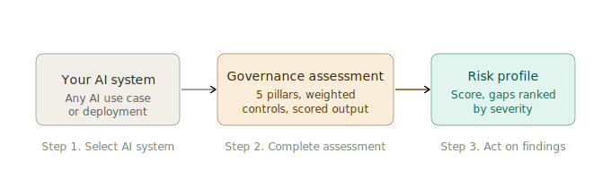

# AI Governance Toolkit
### Risk assessment and controls framework for enterprise AI systems

---

> **Note:** This project is based on work I led at a prior organization. The governance framework, pillar definitions, and risk controls reflect real work done in a regulated enterprise context. Specific metrics and organization names have been masked to respect confidentiality agreements.

---

## Executive Summary

Every AI system deployed in an enterprise carries risk. The question is not whether to manage that risk, but how to do it in a way that is structured, consistent, and defensible to regulators and leadership alike.

This toolkit gives organizations a repeatable way to assess the governance health of any AI system. It asks the right questions, weights the most critical controls appropriately, and produces a scored risk profile with prioritized recommendations. It replaces ad hoc spreadsheet reviews with a framework that scales.

---

## The Problem

Most organizations approach AI governance one of two ways. The first is informal: a checklist that treats all controls as equally important and produces a meaningless score. The second is overly rigid: a compliance process so heavy it slows down AI development without improving safety.

Neither approach helps leadership make decisions. Neither tells you which gaps are critical and which can wait. Neither produces something you can show a regulator with confidence.

This toolkit was built to fill that gap.

---

## For Senior Leadership



**What this system does:** It walks through a structured set of governance questions across five risk areas: data privacy, model risk, human oversight, transparency, and regulatory compliance. Each control is weighted by its severity. The system produces an overall risk score and a prioritized list of the most critical gaps to address.

**Why it matters:** AI governance failures carry real consequences: regulatory penalties, reputational damage, and operational risk. A governance process that does not differentiate between critical and minor gaps gives leadership false confidence. This toolkit surfaces what matters most.

**What it produces:** A scored risk profile from 0 to 100, a breakdown by governance pillar, and a prioritized remediation list sorted by severity. Results can be shared directly with risk teams, compliance officers, and executive leadership.

**What was demonstrated:** This framework was deployed as internal governance tooling for AI use case review at a regulated financial institution. It was used to structure pre-launch governance reviews for AI systems serving consumer-facing products and contributed to significant approved AI infrastructure investment by providing leadership with a defensible risk framework.

---

## For Technical Teams

### Five Governance Pillars

| Pillar | What it covers |
|---|---|
| Data privacy | Personal data handling, user consent, data retention |
| Model risk | Hallucination potential, bias testing, performance monitoring, drift |
| Human oversight | Human review requirements, override capability, audit trail |
| Transparency | Explainability, AI disclosure to users, documented limitations |
| Regulatory compliance | Legal review, industry standards, incident response planning |

### Scoring Methodology

Controls are weighted by severity. Critical controls carry a weight of 3. Standard controls carry a weight of 2.

Each control is answered as Yes (full credit), Partial (half credit), or No (zero credit).

Overall score equals the weighted sum divided by the maximum possible weighted sum, expressed as a percentage.

| Score | Risk level |
|---|---|
| 80 to 100 | Low risk |
| 60 to 79 | Medium risk |
| 35 to 59 | High risk |
| 0 to 34 | Critical risk |

### Running Locally

```bash
git clone https://github.com/Smitakshigupta/AI-Governance-Toolkit.git
cd AI-Governance-Toolkit

npm install
npm start
```

Open http://localhost:3000

### Folder Structure

```
ai-governance-toolkit/
    src/
        GovernanceToolkit.jsx   Main React component
    PRD.md                      Framework design and decision log
    package.json                Node dependencies
    .gitignore
    README.md                   This file
```

---

## Product Framing

Governance is only useful if it drives decisions. A framework that produces a score without telling you what to fix, or treats every control as equally important, does not drive decisions. It produces paperwork.

This toolkit was designed around the question: what does a risk officer or executive actually need to see to take action? The answer shaped every design decision, from weighted controls to sorted recommendations.

---

*Built by Smitakshi Gupta. [LinkedIn](https://linkedin.com/in/Smitakshi-gupta)*
